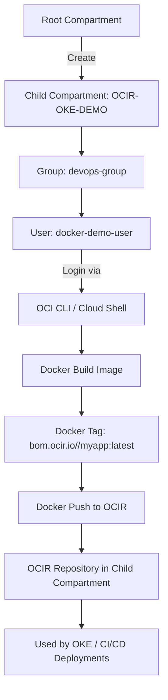

# 🚀 OCI Container Registry (OCIR) Demo — Complete Setup & Push Workflow

This guide walks through **setting up a secure OCI environment** for Docker image storage and deployment, from creating users and compartments to pushing container images to Oracle Container Registry (OCIR).

---

## 🧩 Overview

You will:

1. Create a **child compartment** for DevOps/Docker demo.
2. Create a **user**, assign necessary permissions.
3. Create a **group**, policies, and add user to the group.
4. Configure **OCI CLI** and authenticate Docker with OCIR.
5. Build, tag, and push an image to the **child compartment’s container registry**.
6. Verify the image via OCI Console and CLI.

---

## 🧭 Architecture Diagram



---

## 🧱 Step 1 — Create a Compartment

1. **Via Console:**
   - Go to **Identity & Security → Compartments**
   - Click **Create Compartment**
   - Name: `OCIR-OKE-DEMO`
   - Description: `Compartment for Docker & OCIR demo`
   - Parent: Root Compartment

2. **Via CLI:**
   ```bash
   oci iam compartment create      --name "OCIR-OKE-DEMO"      --description "Compartment for Docker & OCIR demo"      --compartment-id <root-compartment-ocid>
   ```

---

## 👤 Step 2 — Create a User

1. Go to **Identity & Security → Users → Create User**
   - Name: `docker-demo-user`
   - Email: your.email@example.com
   - Create a **Console Password** for the user.

2. Generate an **Auth Token** (needed for Docker login):
   - Go to **User → Auth Tokens → Generate Token**
   - Copy and save it securely.

---

## 👥 Step 3 — Create a Group and Add User

1. Create group:
   ```bash
   oci iam group create --name "devops-group" --description "Group for Docker/OCIR Access"
   ```

2. Add user to group:
   ```bash
   oci iam group add-user      --group-id <group-ocid>      --user-id <user-ocid>
   ```

---

## 🧾 Step 4 — Create Policy for the Group

Create a policy in your **root compartment** to allow the group access to OCIR and artifacts.

**Policy name:** `DevOps-OCIR-Policy`

**Statements:**
```
Allow group devops-group to manage repos in compartment OCIR-OKE-DEMO
Allow group devops-group to manage generic-artifacts in compartment OCIR-OKE-DEMO
Allow group devops-group to read compartments in tenancy
```

Create via CLI:
```bash
oci iam policy create   --name "DevOps-OCIR-Policy"   --description "Allow devops group to manage OCIR repos"   --compartment-id <root-compartment-ocid>   --statements '[
    "Allow group devops-group to manage repos in compartment OCIR-OKE-DEMO",
    "Allow group devops-group to manage generic-artifacts in compartment OCIR-OKE-DEMO",
    "Allow group devops-group to read compartments in tenancy"
  ]'
```

---

## ⚙️ Step 5 — Login to OCI Cloud Shell or Install OCI CLI

### Option A: Use OCI Cloud Shell
- Launch from the top-right Console icon (no install needed)

### Option B: Local CLI setup
- Install from [OCI CLI documentation](https://docs.oracle.com/en-us/iaas/Content/API/SDKDocs/cliinstall.htm)
- Run:
  ```bash
  oci setup config
  ```

---

## 🧭 Step 6 — Create Container Repository in Child Compartment

```bash
oci artifacts container repository create   --compartment-id <child-compartment-ocid>   --display-name myapp   --is-public false   --region ap-mumbai-1
```

Verify:
```bash
oci artifacts container repository list   --compartment-id <child-compartment-ocid>   --region ap-mumbai-1   --output table
```

---

## 🔐 Step 7 — Docker Login to OCIR

Get your **namespace**:
```bash
oci os ns get
```

Login to OCIR:
```bash
docker login bom.ocir.io
```
Use:
- **Username:** `<namespace>/<oci-username>`
- **Password:** Your **Auth Token**

Example:
```bash
Username: bmzcke8ke5xv/docker-demo-user
Password: <auth-token>
```

---

## 🛠️ Step 8 — Build, Tag & Push Image

### Build
```bash
docker build -t myapp:latest .
```

### Tag for OCIR (child compartment repo)
```bash
docker tag myapp:latest bom.ocir.io/bmzcke8ke5xv/myapp:latest
```

### Push
```bash
docker push bom.ocir.io/bmzcke8ke5xv/myapp:latest
```

---

## 🧾 Step 9 — Verify Repository & Image

List repositories:
```bash
oci artifacts container repository list   --compartment-id <child-compartment-ocid>   --region ap-mumbai-1   --output table
```

List images in the repo:
```bash
oci artifacts container image list   --repository-id <repo-ocid>   --region ap-mumbai-1   --output table
```

Or verify via OCI Console → **Developer Services → Container Registry**

---

## 🧹 Step 10 — (Optional) Move or Delete Repositories

Move repo from root to child:
```bash
oci artifacts container repository change-compartment   --repository-id <repo-ocid>   --compartment-id <child-compartment-ocid>
```

Delete repo:
```bash
oci artifacts container repository delete   --repository-id <repo-ocid> --force
```

---

## ✅ Summary Checklist

| Step | Action | Done |
|------|---------|------|
| 1 | Create Child Compartment | ✅ |
| 2 | Create User & Auth Token | ✅ |
| 3 | Create Group & Add User | ✅ |
| 4 | Add Policies | ✅ |
| 5 | Login via Cloud Shell / CLI | ✅ |
| 6 | Create OCIR Repo | ✅ |
| 7 | Docker Login | ✅ |
| 8 | Build, Tag & Push | ✅ |
| 9 | Verify Image | ✅ |

---

## 📘 References
- [OCI Documentation — Container Registry](https://docs.oracle.com/en-us/iaas/Content/Registry/home.htm)
- [OCI CLI Reference](https://docs.oracle.com/en-us/iaas/tools/oci-cli/latest/)
- [Oracle Cloud Shell Docs](https://docs.oracle.com/en-us/iaas/Content/API/Concepts/cloudshellintro.htm)

---

**Author:** Chinmaya (OCI Architect Demo)  
**Last Updated:** November 2025  
